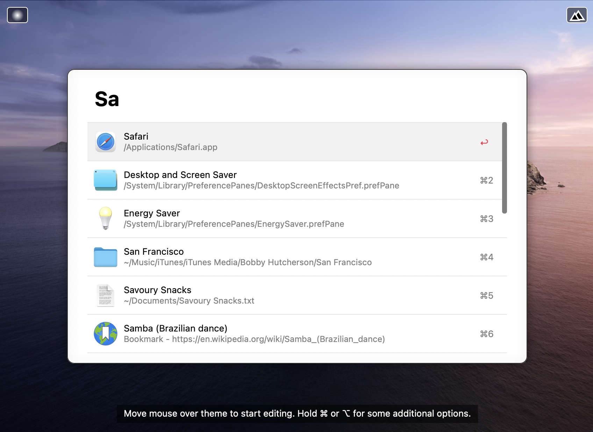
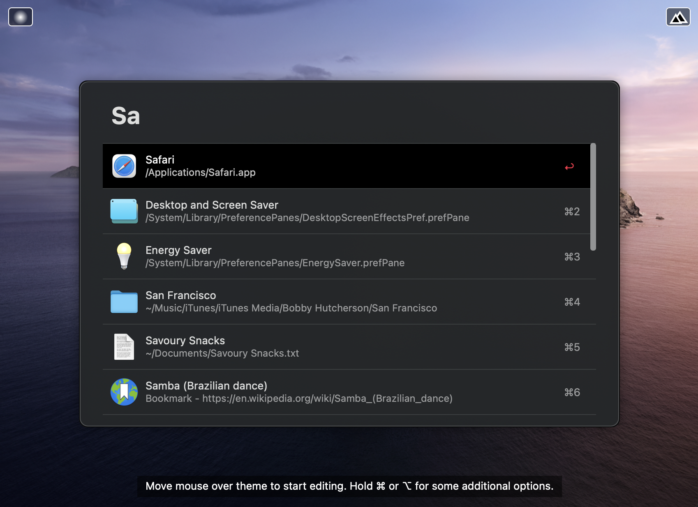
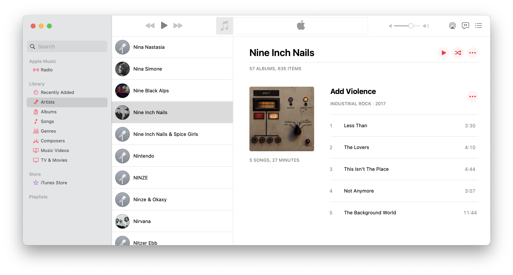
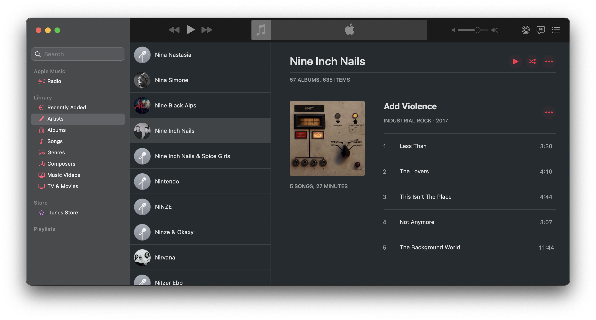

# Music Powerpack Theme

Here is an [Alfred Powerpack Theme](https://www.alfredapp.com/help/appearance/) that is inspired by [Apple Music](https://www.apple.com/apple-music/) appearance and color scheme on Big Sur.

[**Download Themes**](https://github.com/chrismessina/alfred-theme-music/releases/latest)

## Installation

This theme uses [SF Pro Text](https://developer.apple.com/design/human-interface-guidelines/ios/visual-design/typography/), which is [available for download](https://developer.apple.com/fonts/) from Apple. Download and install that first.

Then download and unzip the file above, and double-click each `.alfredappearance` file to install it.

## Previews

### Music (Light)

### Music (Dark)

## Suggested configuration

- Disable the Alfred hat logo by checking: `Alfred Preferences › Appearance › Options › Hide hat on Alfred window`
- Disable result shortcuts by unchecking: `Alfred Preferences › Appearance › Options › Hide result shortcuts`

Simplify results by switching the result subtext to "Only for Alternative Actions".

## Inspiration

The inspiration for this theme is Music.app:

## About

This theme is unaffiliated with nor endorsed by Apple, Inc.

<a href="https://www.alfredforum.com/topic/16378-deliveriesapp-inspired-theme/">Alfred Forum link</a>.
